# Keil µVision5 安装教程

> ***声明：软件仅供学习与交流，禁止商用，否则后果自负***
>
> **第一次做教程，有错误或不足的地方，欢迎指正**
> 
> version: 3.0(2025-11-09)
> 添加了MDK-ARM的安装教程
> 删减了部分不必要的词语
---

- [Keil µVision5 安装教程](#keil-µvision5-安装教程)
  - [一、简介](#一简介)
  - [二、安装前准备](#二安装前准备)
  - [三、下载安装包](#三下载安装包)
    - [3.1 官方下载地址](#31-官方下载地址)
  - [四、安装 Keil µVision5 主程序](#四安装-keil-µvision5-主程序)
    - [4.1 安装步骤](#41-安装步骤)
  - [五、MDK-ARM安装](#五mdk-arm安装)
  - [六、激活与许可证设置](#六激活与许可证设置)
  - [七、安装设备支持包](#七安装设备支持包)
    - [7.1 离线安装（以STM32F103C8T6为例）](#71-离线安装以stm32f103c8t6为例)
  - [八、关于新版MDK缺少Arm Compiler5(AC5)编译链的问题](#八关于新版mdk缺少arm-compiler5ac5编译链的问题)
    - [8.1 安装AC5编译链](#81-安装ac5编译链)
    - [8.2 配置AC5编译链](#82-配置ac5编译链)
  - [九、注意事项](#九注意事项)

---

## 一、简介

Keil µVision5（以下简称Keil5）是ARM官方提供的嵌入式软件开发环境，它集成了编辑器、编译器、调试器及器件支持包等组件，是51 STM32、NXP、GD32、Nordic 等芯片开发的常用工具，下面我来带大家安装Keil5。

---

## 二、安装前准备

在安装前，需关闭windows自带的及第三方安全软件，否则会误删注册机软件。

> **Tips：**
>
> 1. 如果是第三方安全软件（如360安全卫士、火绒等），在**任务栏右键**退出软件即可，
>
> 2. 若是关闭之后微软自带的保护软件windows defender启用或是本身就用此软件，需要在开始**菜单 → 设置 → 隐私与安全 → Windows 安全 → 打开 Windows 安全 → 病毒与威胁防护。** 关闭 ***实时保护*** 即可。
>
> 3. 破解软件没有病毒，放心使用
>
---

## 三、下载安装包

### 3.1 官方下载地址

1. Keil µVision5 官方下载页面：
[https://www.keil.com/download/product/](https://www.keil.com/download/product/)

    > 官方下载需要注册账号，填写个人信息后即可下载需要的软件包。

2. MDK（开发ARM内核，如STM32）：[MDK直接下载链接](https://armkeil.blob.core.windows.net/eval/MDK543a.exe)
C51（开发8051内核，如AT89C51）：[C51直接下载链接](https://www.keil.com/fid/wisv60wx6b1j1ww3tm91rgd4umlghujm0o3fd1/files/eval/c51v961.exe)

    >可以试试这个直接下载的链接，若后面更新了新的版本，可以直接将包的版本名改为最新版本

3. 破解软件下载地址：[注册机下载链接](https://caspiancky.lanzouw.com/b016kdb9yb)
密码:cxp1

    > **再次提醒：** 下载前 **确保关闭防火墙和杀毒软件**，否则注册机可能无法正常使用。

4. 整合链接(百度网盘，但是速度会慢)
[百度网盘链接](https://pan.baidu.com/s/1egXqWtf59_fSl2C2uUVN6A)
提取码: 16jg

> 资源为网络搜索所得，侵删。

---

## 四、安装 Keil µVision5 主程序

### 4.1 安装步骤

下载之后的Keil5 C51软件，如图所示

**右键点击 `C51V961.EXE`，选择“以管理员身份运行”**

> 若出现 Windows 安全提示，请点击“允许”。

1. 点击 `Next`。
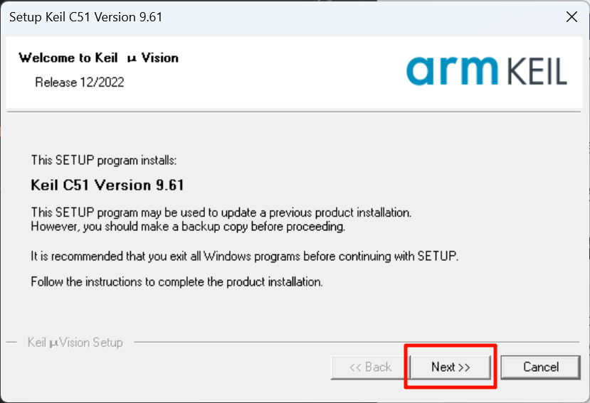

1. 阅读后勾选 “I accept the terms…” → 点击 `Next`。
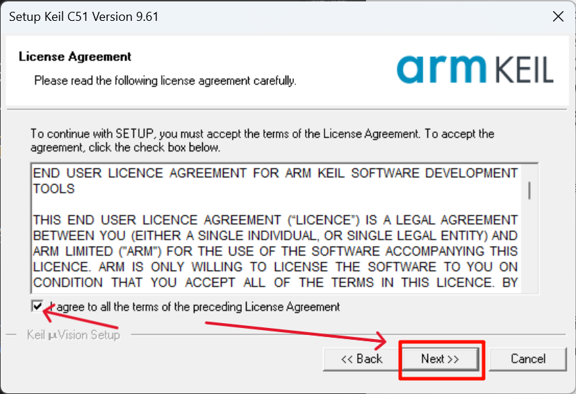

1. 建议安装在除系统盘之外的盘中，文件夹的名字可以自定义，例如 **`D:\Keil5`**
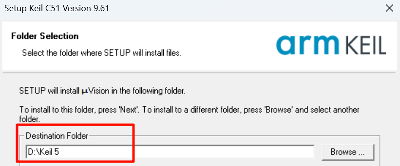

   > **Tips: 不要安装到含中文或空格的路径，且系统用户名建议改成英文名以防后续工具链或编译中识别错误**

1. **随意填写即可**：
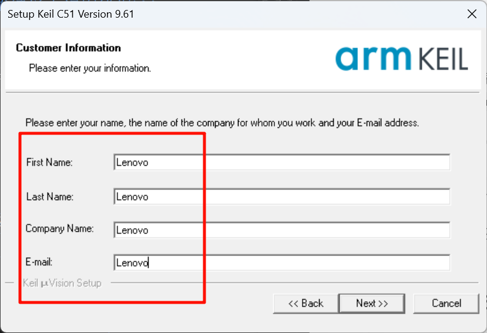

1. 安装大概需要 2-5 分钟，先打杯水喝（doge）。

---

## 五、MDK-ARM安装

1. 前面的步骤和C51安装步骤相同，只是运行的是的是MDK-ARM软件包
  
    > 注意以管理员权限安装

2. 安装路径可以自定义，但是建议和C51安装路径一致，这样51和32就可以在同一个目录下了，可以自由选择开发不同内核的项目。
3. MDK需要额外选择一个Pack包的路径，这里可以提前在Keil5原路径创建一个文件夹，例如我的文件夹名字是Packs，那么路径就是 **`D:\Keil5\Pack`**
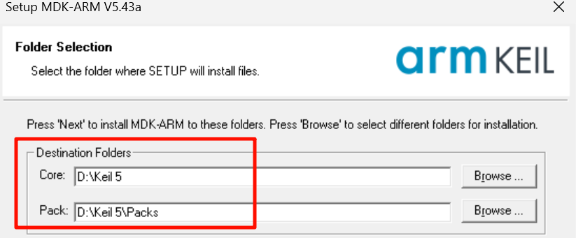

4. 安装大概需要 2-5 分钟，安装过程会有**驱动程序安装的弹窗**，我们选择同意即可
5. 安装完成后，点击Finish，之后会出现一个在线安装Packs的弹窗，我们选择关闭即可。
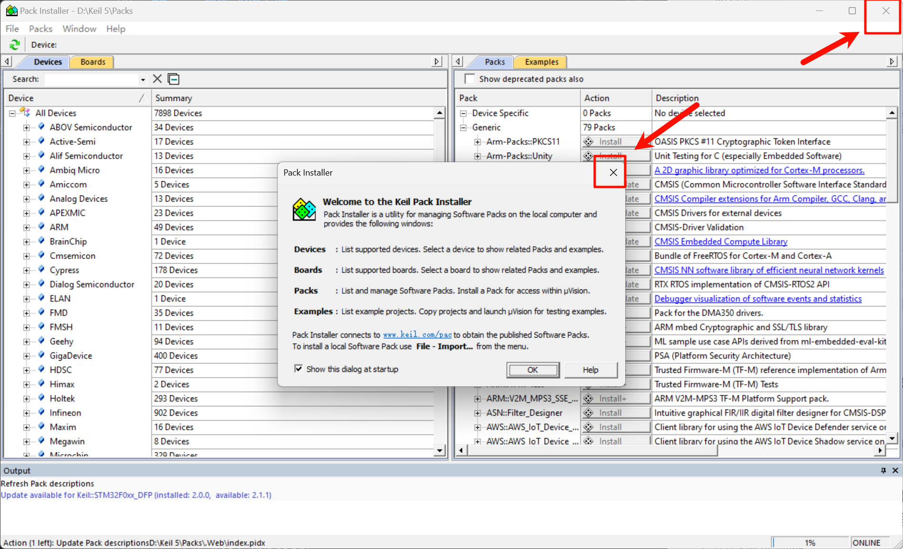

6. 安装结束，接下来我们连同C51一起破解。

---

## 六、激活与许可证设置

1. 安装后的软件以及下载的注册机图片如下：
Keil5：

注册机：

> **Tips： 注册机打开之前要把音量调小！**

1. 右键以管理员身份运行Keil5，然后进入界面，点击左上角的`File`再点击`License Manager`，进入许可证管理界面。
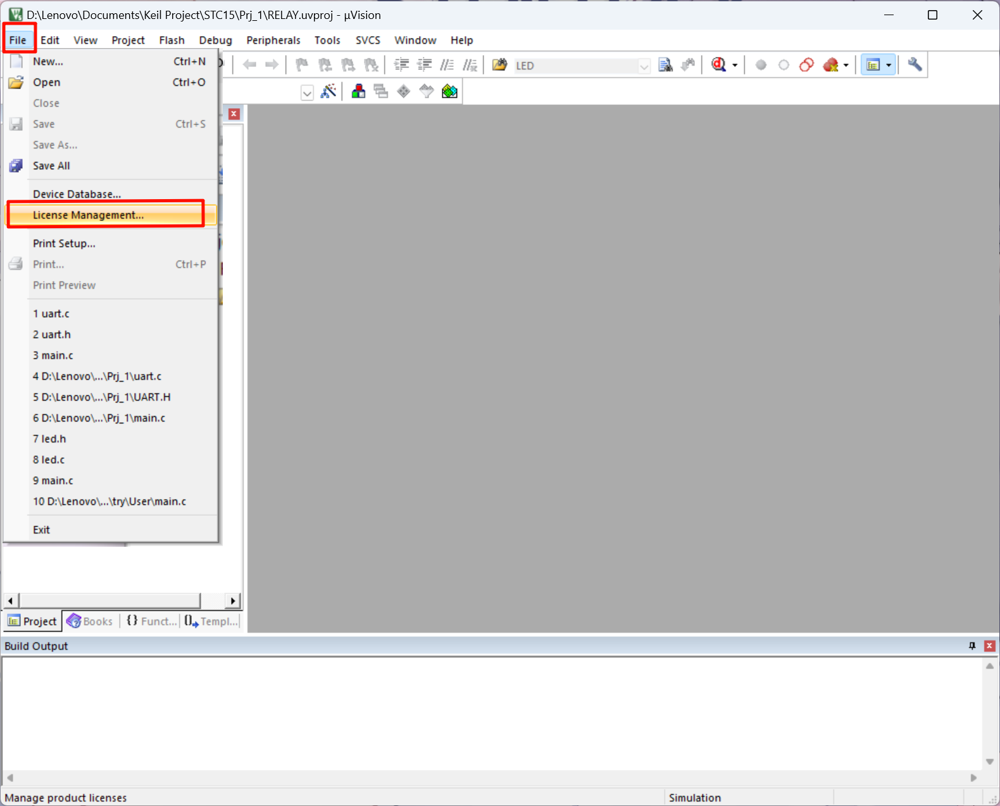

2. 在许可证管理界面，复制 ***Computer ID*** ，并将其粘贴到注册机的 ***CID*** 框中。
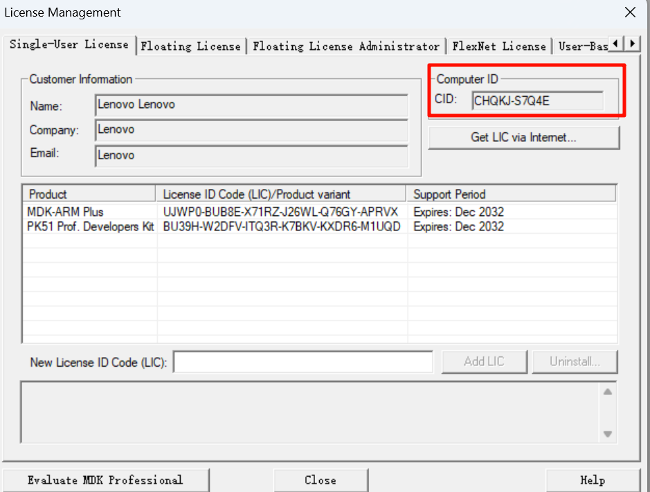

3.Keil5如果下的是C51，那么`Target`选择的是`C51`，如果是MDK-ARM选择的是`ARM`点击注册机中的`Generate`按钮，生成许可证。

1. 将生成的许可证复制，并粘贴到Keil5的许可证管理界面中，点击“Update”按钮，完成激活。
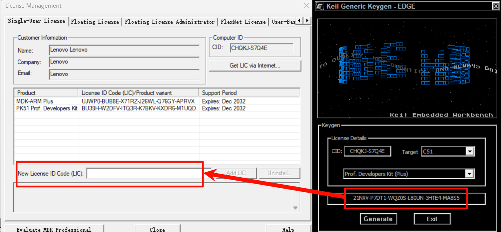

1. 激活完成后，显示 **`LIC Added Sucessfully`** ，点击“Close”按钮，关闭许可证管理界面。
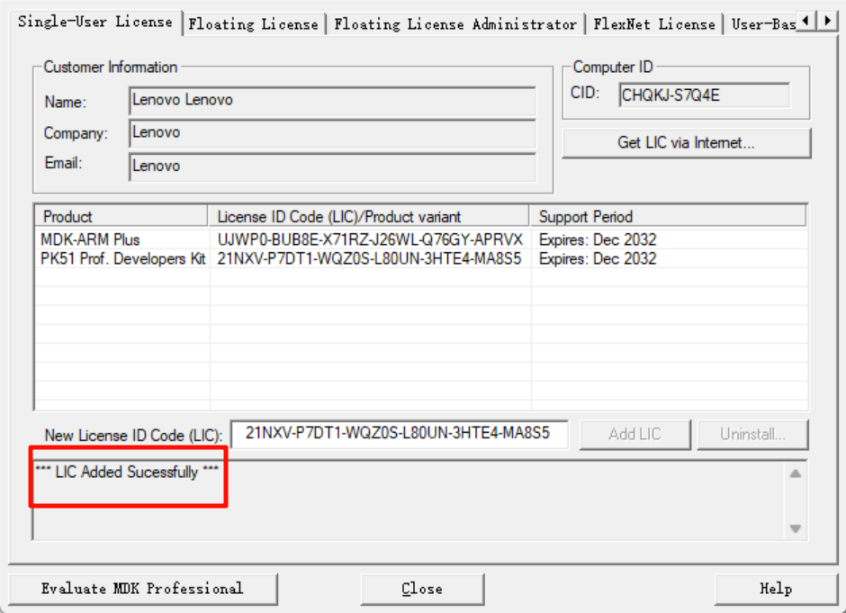

1. MDK-ARM也需要激活，**步骤和C51相同**，只是注册机的`Target`选择的是`ARM`，而不是`C51`。

1. 破解之后可以开始使用keil5去开发我们的51单片机了，如果是32单片机，接下来我们根据需要去安装对应的**DFP包**。

> ***Tips：这一步的两个软件一定要管理员安装，否则会提示权限不足。***

---

## 七、安装设备支持包

安装完MDK-ARM程序后，还需安装芯片厂商的设备包（DFP），以便 Keil 识别对应 MCU。
在线安装较慢，这里们选择离线安装。

### 7.1 离线安装（以STM32F103C8T6为例）

1. 从 Keil 官方 Pack 页面下载：
   [https://www.keil.arm.com/packs/](https://www.keil.arm.com/devices/)
2. 输入你想要的芯片，比如我们常用的STM32F1系列，输入后会显示相关的DFP包，找到`STM32F1xX_DFP`点击`Download version 2.4.1`下载
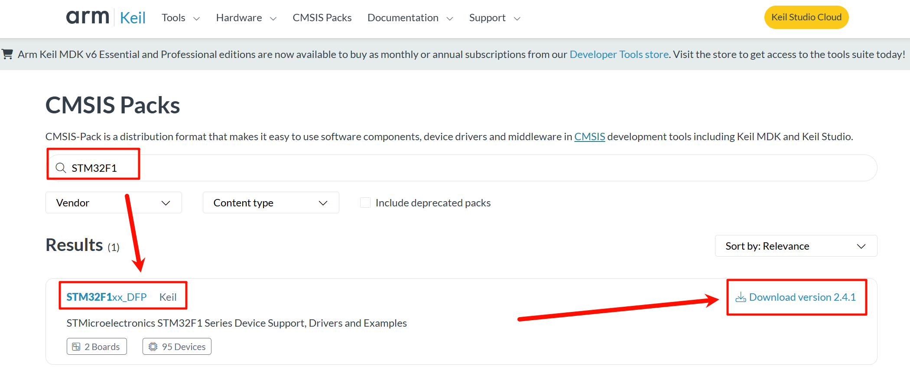

3. 下载完成后，双击安装包，按照提示安装即可。
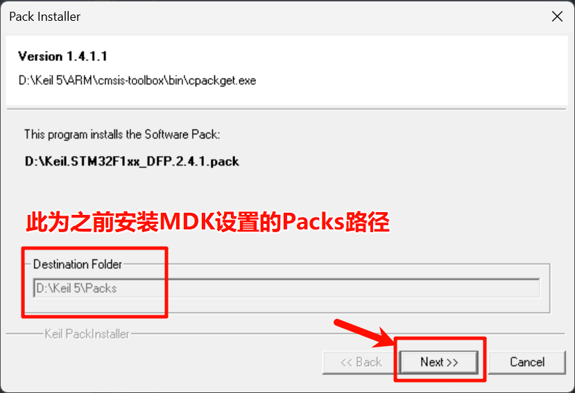

4. 安装完成后，就可以使用了

5. 其他的芯片安装方法和STM32F103C8T6相同，这里我准备了几个常用的STM系列的DFP包，链接如下：
[Pack包下载链接（点击此处下载）](https://caspiancky.lanzouw.com/b016kdctha)
密码:c3rw

---

## 八、关于新版MDK缺少Arm Compiler5(AC5)编译链的问题

**新版MDK默认不包含AC5编译链，但大部分旧的工程还是用AC5编译的，所以需要手动安装AC5编译链。**

### 8.1 安装AC5编译链

本教程安装的编译链版本为V5.06 update 7 (build 960)

1. 从Arm官网下载AC5编译链：[https://developer.arm.com/downloads/view/ACOMP5?revision=r5p1-03rel1&sortBy=availableBy](https://developer.arm.com/downloads/view/ACOMP5?revision=r5p1-03rel1&sortBy=availableBy)

2. 下载完成后，解压安装包，右键点击`setup.exe`，选择“以管理员身份运行”，按照提示安装即可。
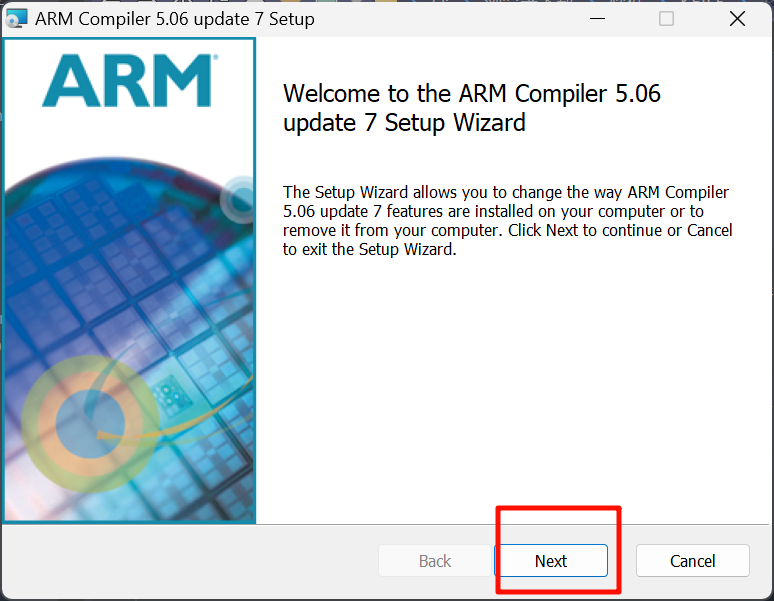

3. 选择安装路径，**一定要在Keil5的安装路径下的ARM文件夹**，(*`D:\Keil5\ARM\XXX`*)，并在ARM文件夹中创建一个新的文件夹，这里我取名ARMCC，因为AC5是基于ARMCC的编译链。
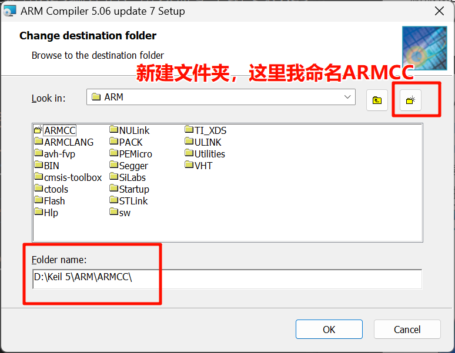

4. 点击`Next`，继续安装。
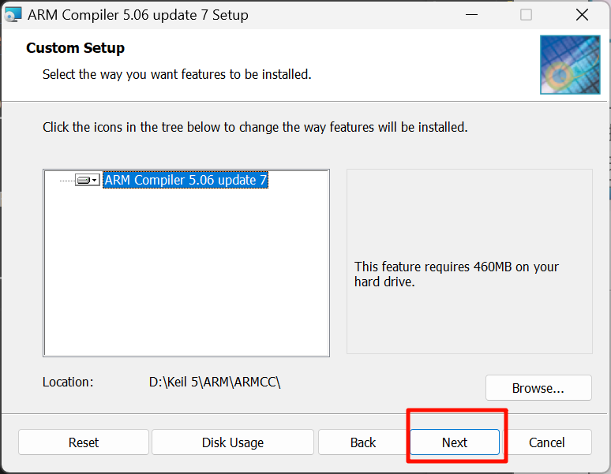

5. 点击`Install`，等待安装完成。
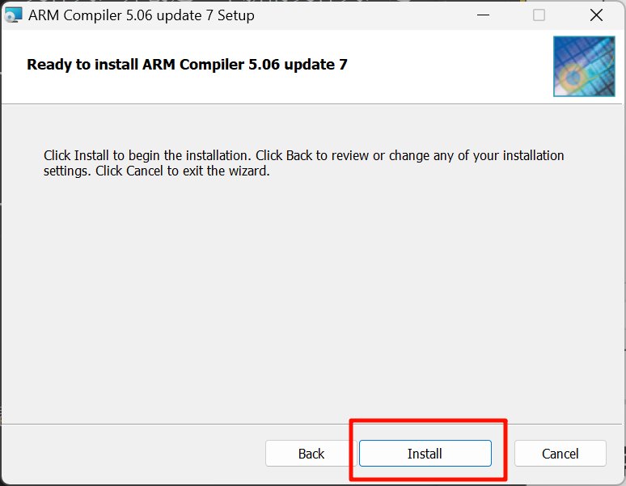

6. 取消勾选`Launch release notes`，点击`Finish`，完成安装。
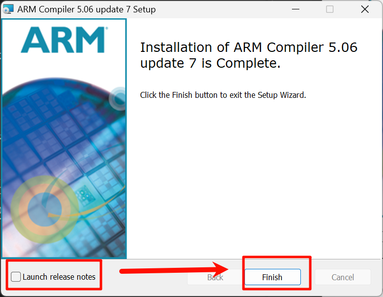

### 8.2 配置AC5编译链

配置编译链需要有工程文件，这里我默认你已经有了一个工程，创建工程的教程可以在b站看看[正点原子的课程](https://www.bilibili.com/video/BV1bv4y1R7dp?p=20&vd_source=48bcceafa28cb6a0ec4d2cdbf8af8286)。

> 新建工程这个地方正点原子做得很详细，我暂时就不重复了。

1. 在工程里面点击**红绿白**三个色块的图案(Manage Project Items)
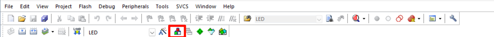

2. 点击 **`Folders/Extensions`**
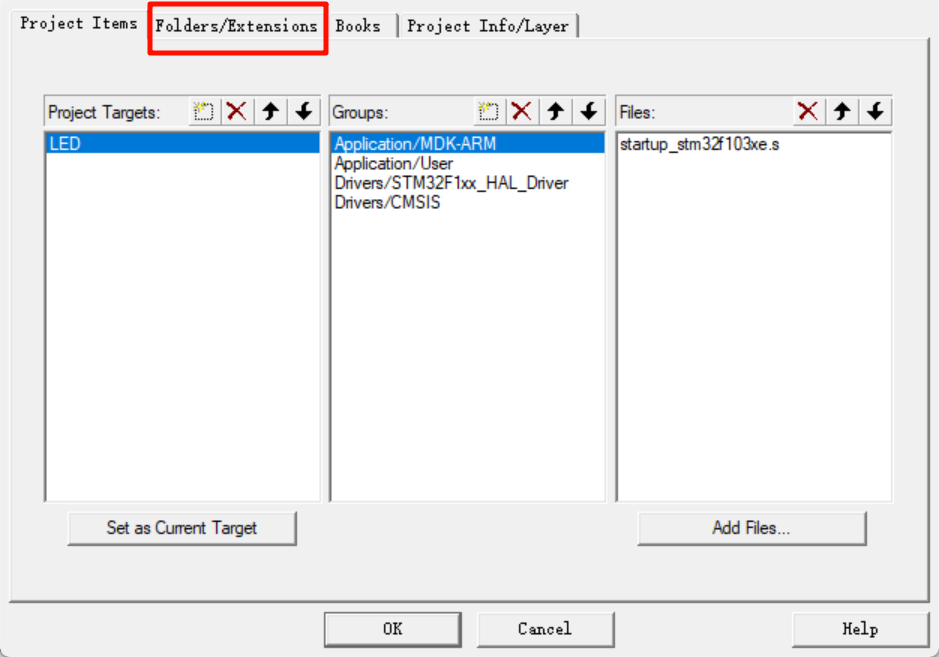

3. 点击中间一栏的三个点`...`，进入配置界面。
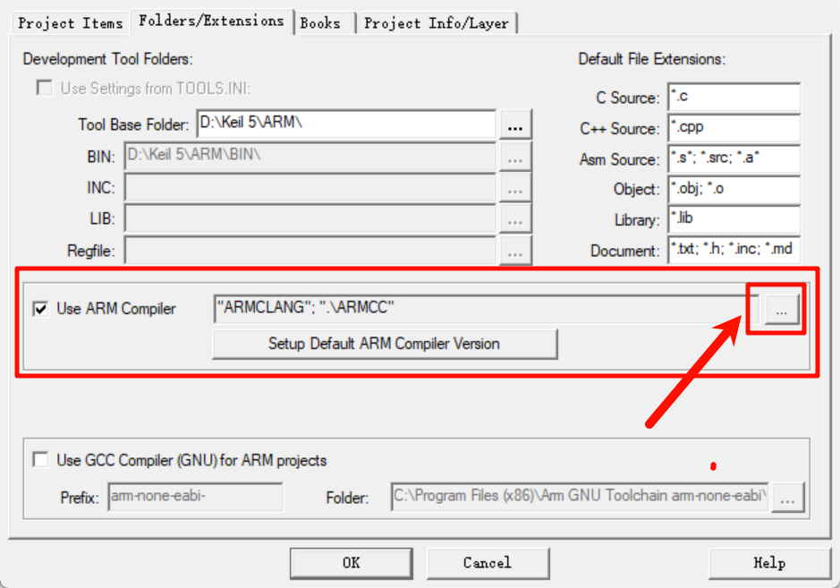

4. 点击下方的 **`Add another ARM Compiler Version to List.`** ，选择我们刚刚安装的AC5编译链的路径，如：`D:\Keil5\ARM\ARMCC`点击`确定`，然后点击`Close`关闭窗口。
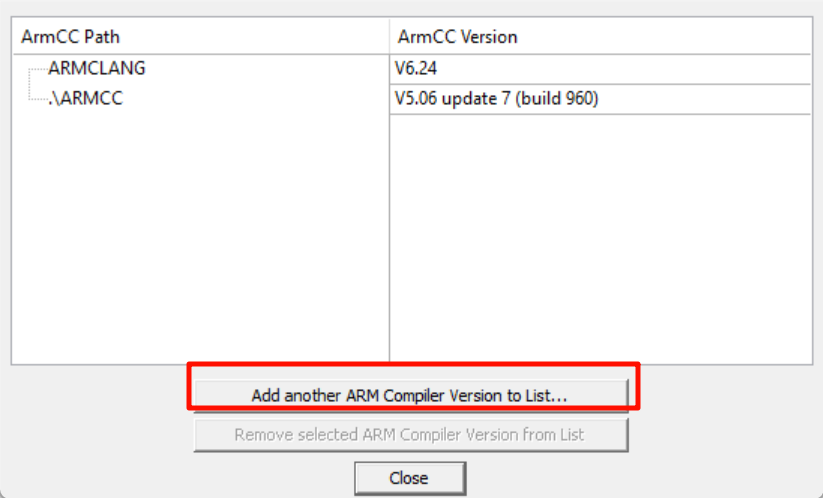

5. 在中间栏点击`Setup Default ARM Compiler Version`
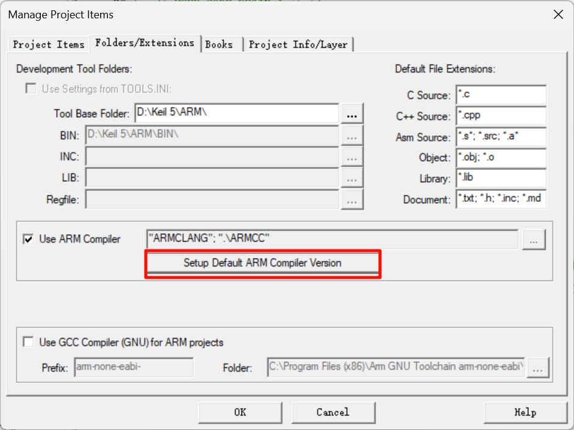

6. 检查一下我们默认的AC5编译链是否是我们安装的版本，系统默认用个自的最新版，不用管，然后点击`OK`关闭窗口。
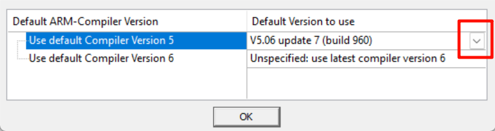

7. 点击这个我们叫做魔法棒的图标（工程配置界面），点击`C/C++`，在`ARM Compiler`中选择我们安装的AC5编译链。
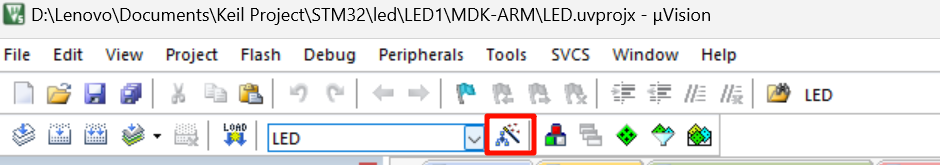

8. 点击`OK`，完成配置。

---

## 九、注意事项

keil5的安装相对轻松，确保以下几点基本就不会有问题：

1. 请关闭防火墙和杀毒软件后重新安装。
2. 路径没有中文或空格，且系统用户名为英文名，
3. 激活的时候用管理员权限运行keil5和注册机。

---

辛苦你看到这里，后续会更一些别的教程或自己的一些想法，我们下次见

***声明：软件仅供学习与交流，禁止商用，否则后果自负***
